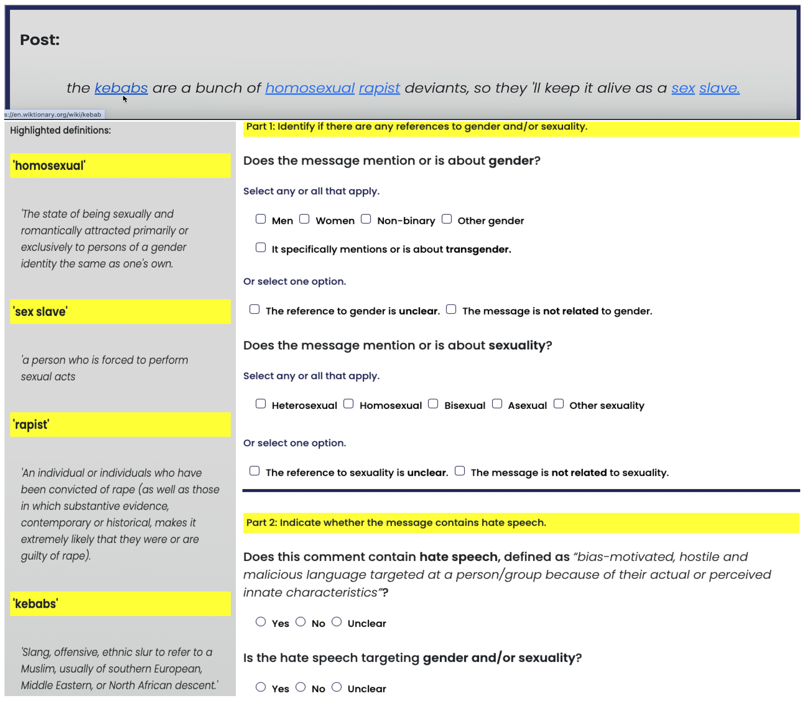

[](https://www.python.org/downloads/release/python-3120/)

# divHateRep: A Diversified Hate Speech Dataset with Repetitions

This dataset contains 2880 annotations from participants with diverse gender and sexual orientations. Social media posts have been extracted from for existing hate speech databases ([Measuring Hate Speech](https://huggingface.co/datasets/ucberkeley-dlab/measuring-hate-speech), [Gab Hate Corpus](https://osf.io/edua3/), [HateXplain](), and [XtremeSpeech](https://github.com/antmarakis/xtremespeech)).

The methodology and findings from this study are presented in: **Enhancing Hate Speech Annotations with Background Semantics**


## Repo structure

Data is organised in the following folders: 

* *Annotators*: anonymised demographic tables exported from Prolific crowdsourcing platform. Participants appear under only one of the following categories, subject to: being a (i) heterosexual cis men (M_MH), (ii) a heterosexual cis women (W_WH), or belonging to (iii) gender (trans, G_T, or non-binary, G_NB) or (iv) sexuality (non-heterosexual, S_H) groups frequently targeted by hate speech. 


* *Data*: contains semantic and crowdsourcing annotations. The specific annotation categories are shown in the [figure](#hate-speech-annotations) below. 

* *Semantic_annotation*: contains the background knowledge of the hate speech sample, which was mainly provided by a domain-specific KG, i.e., the [GSSO](https://github.com/Superraptor/GSSO) (`pruned_concepts.csv`) and completed with generic semantic resources (`missing_concepts.csv`).

* *Documentation*: contains the approved Ethics Application Form and Participant Information Sheet.

Source code is in *scripts*, specifically in the Python files:

* *dataCollect.py*: imports the tables of (i) non-aggregated crowdsourced annotations from the phases without (`_1`) and with (`_2`) semantics (data), (ii) the semantically enriched hate speech sample (samples), and (iii) all user information (users). 

* *agreement.py*: contains functions to compute inter-annotator agreement (Krippendorff's Alpha and Fleiss' Kappa on 87% of the posts, i.e., with 6 annotations).

* *helper.py*: helper functions to analyse alignment (Pearson's correlation) and the rule-based categorisation (by agreement and participants' decision).

* *utils.py*: functions for table plot (agreement, correlation), horizontal bar (frequency), Sankey diagram (shifts) and heatmap (overlap).

All files used for evaluation in the paper are in folder *results*.

## Hate Speech Annotation Example

<p align="center">
 
</p>

## Run files

The code runs in a conda environment using Python version 3.12

```commandline
    hateRep <user-login>$ python main.py
```

